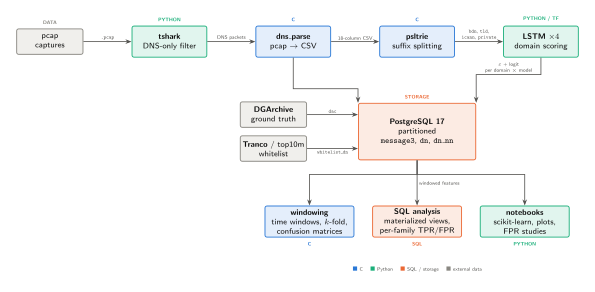
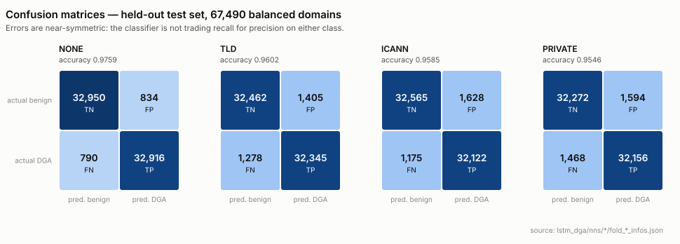

# DGA Detection & Analysis Framework

**Detecting malware in DNS traffic at scale** — an end-to-end research pipeline that
ingests raw packet captures, scores every domain with an LSTM classifier, stores ~393
million DNS messages in PostgreSQL, and looks for infected hosts in the result.

PhD research code, Università Politecnica delle Marche.

---

## The problem

Malware needs to reach its command-and-control server without that address being
blocklisted. **Domain Generation Algorithms** solve this for the attacker: the malware and
its operator both run the same algorithm, generating thousands of pseudo-random domains
per day (`mortiscontrastatim.com`, `cvyh1po636avyrsxebwbkn7.ddns.net`). The operator
registers one; the infected host tries them all until something answers. Blocklists cannot
keep up with a moving target of that size.

But the attempts are visible. Every failed lookup is a DNS query leaving the network, and
most of them return NXDOMAIN. **The question this project asks is whether an infected host
can be identified from its DNS traffic alone** — first by classifying individual domain
names, then by looking at a host's query behaviour over time.

---

## Pipeline



| Stage | Directory | Language | Role |
|---|---|---|---|
| Capture filtering | — | `tshark` | keep well-formed DNS packets only |
| Packet parsing | [`dns_parse/`](dns_parse/) | C | pcap → 18-column CSV, one row per DNS message |
| Suffix splitting | [`psltrie/`](psltrie/) | C | Public Suffix List trie → `bdn`, `tld`, `icann`, `private` |
| Classification | [`lstm_dga/`](lstm_dga/) | Python / TensorFlow | 4 LSTM sub-models → DGA probability + logit |
| Storage | [`asset/sql/`](asset/sql/) | PostgreSQL 17 | list-partitioned message log, materialized views |
| Ground truth | [`dgarchive/`](dgarchive/) | SQL / notebooks | DGArchive family labels, Tranco/top10m whitelisting |
| Host detection | [`windowing/`](windowing/) | C | time-windowed features, *k*-fold CV, confusion matrices |
| Analysis | [`ml/`](ml/), [`scripts/`](scripts/) | Python / Jupyter | scikit-learn experiments, plots, FPR studies |

Orchestration lives in [`suite2/`](suite2/) (dependency-injection services), driven by the
scripts in [`scripts/`](scripts/).

---

## Results

Full detail, with a source line for every number, is in **[docs/RESULTS.md](docs/RESULTS.md)**.

### Scale

| | |
|---|---|
| **392,970,444** | DNS messages analysed (10-day university capture) |
| **~120.6M** | DGArchive domains scored, across 56 malware families |
| **7,254,902** | domains in the whitelist |
| **674,898** | labelled domains in the LSTM training set |

### Domain classification

Four LSTM sub-models, each trained on a different portion of the domain name, on a
balanced 67,490-domain held-out test set:

| Sub-model | Input | Accuracy | F1 |
|---|---|---|---|
| **NONE** | whole domain | **0.9759** | 0.9759 |
| TLD | TLD stripped | 0.9602 | 0.9602 |
| ICANN | registered domain | 0.9585 | 0.9585 |
| PRIVATE | private suffix | 0.9546 | 0.9546 |

The whole domain wins: stripping any part of the name costs accuracy, so the suffix
carries signal rather than noise.



### The interesting finding

Scored against all 56 DGArchive families, the classifier splits the problem cleanly in two:

| | Mean TPR |
|---|---|
| **Algorithmic DGAs** — symmi, padcrypt, murofet, corebot, emotet | **0.99+** |
| **Word-list DGAs** — suppobox, pushdo, gozi, matsnu | **0.12 – 0.72** |

Families that build domains by concatenating dictionary words defeat a character-level
model, because there is no lexical randomness left to detect. That limitation is the
reason the project moves on from classifying domains to classifying **hosts** over time
windows — a host running a word-list DGA still produces an anomalous volume and failure
pattern of DNS queries even when each individual name looks ordinary.

That second problem is **not solved here**: within-family host detection works, but
cross-family generalization does not, and the labelled data is thin (6–138 windows per
family). [docs/RESULTS.md §4](docs/RESULTS.md#4-host-level-detection-over-time-windows-open-problem)
reports it honestly, including the failure cases.

---

## Tech stack

**Python 3.12** · TensorFlow 2.13 · scikit-learn · pandas · SQLAlchemy ·
**C** (libpcap, libpq) · **PostgreSQL 17** · Jupyter · Next.js + NestJS + Flask · LaTeX/TikZ

| Language | Files | Lines |
|---|---|---|
| Python | 111 | 11,422 |
| C / headers | 72 | 13,360 |
| SQL | 35 | 2,246 |
| TypeScript / TSX | 83 | 3,779 |
| LaTeX | 16 | 2,134 |
| Jupyter notebooks | 57 | — |

Notable engineering: a 393M-row message log partitioned by capture; per-partition
materialized views that fold in DGArchive labels, whitelist ranks and domain-validity
ranks in one pass; and a C implementation of the windowing/*k*-fold experiment that talks
to PostgreSQL directly for speed.

---

## Repository layout

| Path | What it is |
|---|---|
| `dns_parse/` | pcap → CSV DNS parser (C). Third-party, LANL — see [`MODIFICATIONS.md`](dns_parse/MODIFICATIONS.md) |
| `psltrie/` | Public Suffix List trie (C) |
| `windowing/` | windowed features, *k*-fold CV, confusion matrices (C) |
| `lstm_dga/` | the LSTM classifier and its trained models |
| `suite2/` | current orchestration services (supersedes `suite/`) |
| `suite/` | **deprecated** — kept for reference, unused by `scripts/` |
| `scripts/` | entry points: DB population, materialized views, windowing |
| `asset/sql/` | 34 hand-written analysis queries, DDL and functions |
| `ml/` | 36 notebooks: analysis, datasets, simulations, FPR studies |
| `dgarchive/`, `tranco/` | ground truth and whitelisting |
| `web/mwdb/` | prototype UI for assembling pcap datasets and generating detection plots (Next.js + NestJS + Flask; incomplete, unmaintained since 2024) |
| `docs/` | [setup](docs/SETUP.md), [results](docs/RESULTS.md), figures |
| `tikz/` | thesis and paper diagrams |

---

## Quickstart

Full instructions — including the two Python environments and the database setup — are in
**[docs/SETUP.md](docs/SETUP.md)**.

```sh
# C components
cd dns_parse && make          # -> bin/dns_parse     (needs libpcap)
cd psltrie   && make prod     # -> bin/binary_prod
cd windowing && make prod     # -> bin/binary_prod   (needs libpq)

# Python (main environment)
pyenv virtualenv 3.12.12 phd && pyenv activate phd
pip install tensorflow==2.13.0
pip install pandas psycopg2-binary sqlalchemy dependency_injector requests tabulate

# run a pipeline stage
python scripts/dbfill.py
```

Rebuild the pipeline diagram with `docs/figures/build.sh` (needs `pdflatex` and `pdf2svg`).

---

## Status and caveats

This is a research codebase, not a product, and it is honest about that:

- **It does not run out of the box.** Absolute paths and database credentials are
  hardcoded throughout; each script carries its own config block that must be edited.
- **The datasets are not here.** DGArchive is licensed ground truth, the `ti2016` capture
  is private, and `.gitignore` excludes all intermediate CSVs. [docs/SETUP.md](docs/SETUP.md#5-datasets)
  lists where to obtain what.
- **`run.py` is broken** — use the `scripts/` entry points instead.
- Notebooks under `ml/` are working scratchpads; several are experimental dead ends kept
  for reference, and some comments and notes are in Italian.

---

## Publications

Lorenzo Principi, *Innovative techniques based on traffic analysis and machine learning
for malware and botnet detection in real networks* — Università Politecnica delle Marche.

- IEEE CSR 2023, Venice
- IEEE ICMLCN 2024, Stockholm
- IEEE CyberComp 2024, Melaka

## Attribution

- `dns_parse/` — originally by Paul Ferrell, Los Alamos National Laboratory; see
  [`dns_parse/LICENSE`](dns_parse/LICENSE) and [`dns_parse/MODIFICATIONS.md`](dns_parse/MODIFICATIONS.md).
- `psltrie/` and `windowing/` are built on
  [pantuza/c-project-template](https://github.com/pantuza/c-project-template) (MIT,
  © 2016 Gustavo Pantuza).
- Public Suffix List data from [publicsuffix.org](https://publicsuffix.org) (Mozilla, MPL 2.0).
- Ground truth from [DGArchive](https://dgarchive.caad.fkie.fraunhofer.de/) (Fraunhofer FKIE)
  and [Tranco](https://tranco-list.eu/).
