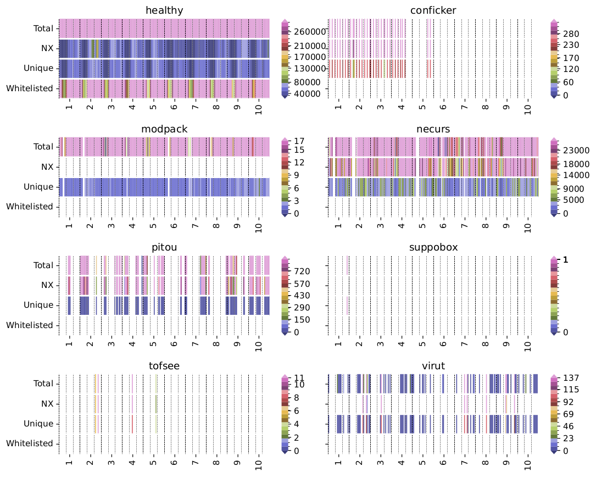
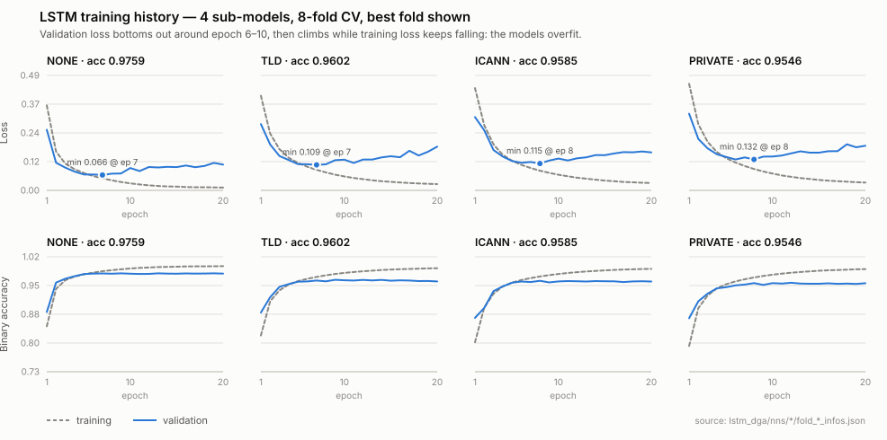
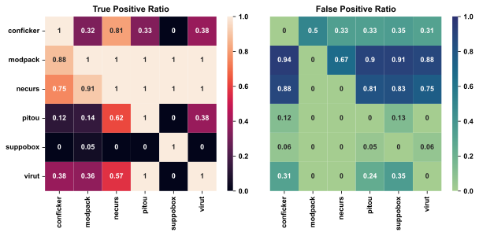

# Results

Every number on this page carries a **source line** pointing at the file it came from.
Nothing here was recomputed for the README — these are the values recorded in the
repository at the time the experiments were run.

A note on trust, up front: the LSTM figures (§2, §3) come from saved training artifacts
and a large-scale evaluation, and are reliable. The host-level windowing results (§4) are
from a small experiment with very few labelled windows, and are reported here as an
**open problem**, not as a headline. Several notebooks in `ml/` are scratchpads whose
source CSVs no longer exist; their numbers are deliberately excluded.

---

## 1. Scale

| Quantity | Value |
|---|---|
| DNS messages in the main capture (`ti2016`) | **392,970,444** |
| Capture length | 10 days (10 daily partitions, ~39.3M messages/day) |
| DGA families labelled in the capture | 8 (`healthy`, `conficker`, `modpack`, `necurs`, `pitou`, `suppobox`, `tofsee`, `virut`) |
| DGArchive domains scored | **~120.6M** unique domains, **56** families |
| Total LSTM scorings over DGArchive | **482,476,192** (each domain × 4 sub-models) |
| Whitelist size | **7,254,902** domains (`top10m`, 2020) |
| LSTM training set | **674,898** domains (337,500 DGA / 337,398 benign) |

> Sources: `asset/sql/message2_count.sql` lines 19–28 (recorded `RAISE NOTICE` output,
> partitions 0–9, summed); `scripts/lstm/dac/main.ipynb` cell 7 (`tp count` summed over
> 56 families = 482,476,192 across 4 sub-models); `top10m.py:36`;
> `asset/ml/dataset_training_mterics.ipynb`.



*Per-family DNS activity over the 10 days (total / NX / unique / whitelisted, hourly).
Benign traffic dwarfs every infected host; `suppobox` is almost silent, which is exactly
why it is hard to catch. Source: `scripts/it16/megaplot/plot_malwares.pdf`.*

---

## 2. The LSTM classifier

### Architecture

```
Input(60 chars) → Embedding(vocab 40, dim 32) → LSTM(256) → Dropout(0.5) → Dense(1, sigmoid)
```

Domains are reversed label-wise before encoding (`www.example.com` → `com.example.www`),
so the most significant part of the name is seen first.

> Source: `lstm_dga/nns/json_tf2.13/model_icann.json`;
> `suite2/suite2/lstm/lstm_service.py` (`max_len = 60`, 40-symbol vocabulary, reversal).

### The four sub-models

The same network is trained four times on a **different portion of the domain**, split by
the Public Suffix List. This is the design question the project set out to answer: *which
part of a domain name carries the DGA signal?*

| Sub-model | Input | Test accuracy |
|---|---|---|
| **NONE** | the whole domain, unmodified | **0.97594** |
| **TLD** | domain with the TLD stripped | 0.96025 |
| **ICANN** | the ICANN registered domain | 0.95847 |
| **PRIVATE** | the private-suffix portion | 0.95463 |

Training: 2022-03-18, 256 units, 8-fold cross-validation, 20 epochs, binary objective.
Test set: 67,490 held-out domains, near-perfectly balanced — exactly 10% of the 674,898
training rows.

**The whole domain wins.** Stripping any part of the name costs accuracy, which says the
suffix itself carries usable signal rather than being noise to be removed.

> Source: `lstm_dga/nns/README.md` (four `classification_report` blocks);
> `lstm_dga/nns/{NONE,TLD,ICANN,PRIVATE}/README.md` (training configuration).

### Per-class detail (NONE, the best model)

| Class | Precision | Recall | F1 | Support |
|---|---|---|---|---|
| benign | 0.97659 | 0.97531 | 0.97595 | 33,784 |
| DGA | 0.97529 | 0.97656 | 0.97593 | 33,706 |
| **accuracy** | | | **0.97594** | 67,490 |

> Source: `lstm_dga/nns/README.md`.

### Confusion matrices


| Sub-model | TN | FP | FN | TP | Fold |
|---|---|---|---|---|---|
| NONE | 32,950 | 834 | 790 | 32,916 | 2 |
| TLD | 32,462 | 1,405 | 1,278 | 32,345 | 6 |
| ICANN | 32,565 | 1,628 | 1,175 | 32,122 | 3 |
| PRIVATE | 32,272 | 1,594 | 1,468 | 32,156 | 7 |

Errors are near-symmetric in every model — the classifier is not buying recall with
precision or vice versa.

> Source: `lstm_dga/nns/{NONE,TLD,ICANN,PRIVATE}/fold_*_infos.json`, key `confusion_matrix`.

### Training history



Validation loss reaches its minimum at **epoch 7–8** in every sub-model and then climbs
while training loss keeps falling — textbook overfitting past that point:

| Sub-model | Best val. loss | At epoch | Val. loss at epoch 20 |
|---|---|---|---|
| NONE | 0.0656 | 7 | 0.1100 |
| TLD | 0.1085 | 7 | 0.1866 |
| ICANN | 0.1145 | 8 | 0.1620 |
| PRIVATE | 0.1317 | 8 | 0.1903 |

The published models are the **epoch-20** checkpoints, so there is accuracy left on the
table: early stopping around epoch 8 is the obvious improvement.

> Source: `lstm_dga/nns/*/fold_*_infos.json`, key `history`.

---

## 3. Generalization: 120M DGArchive domains

The classifier was then run over the whole of DGArchive 2020 — ~120.6M domains across 56
families, spanning 2006–2019 — with detections whitelisted against Tranco. This is where
the interesting result is.

**Algorithmic DGAs are essentially solved. Word-list DGAs are not.**

| Family | ICANN | NONE | PRIVATE | TLD |
|---|---|---|---|---|
| symmi | 0.9993 | **0.99998** | 0.8761 | 0.9995 |
| padcrypt | 0.9976 | 0.9961 | 0.9963 | 0.9969 |
| murofet | 0.9955 | 0.9959 | 0.9922 | 0.9925 |
| corebot | 0.9931 | 0.9944 | 0.9961 | 0.9933 |
| emotet | 0.9946 | 0.9984 | 0.9917 | 0.9927 |
| ranbyus | 0.9937 | 0.9950 | 0.9902 | 0.9916 |
| cryptolocker | 0.9871 | 0.9862 | 0.9823 | 0.9820 |
| qadars | 0.9400 | 0.9615 | 0.9577 | 0.9464 |
| pykspa | 0.8832 | 0.8497 | 0.8707 | 0.8644 |
| nymaim | 0.8405 | 0.7942 | 0.8286 | 0.8225 |
| necurs | 0.8364 | 0.9109 | 0.8324 | 0.8313 |
| conficker | 0.8066 | 0.7524 | 0.7946 | 0.7864 |
| **suppobox** | 0.6828 | 0.6988 | 0.7231 | 0.6592 |
| **pushdo** | 0.6597 | 0.4558 | 0.6865 | 0.5698 |
| **gozi** | 0.3030 | 0.2167 | 0.3153 | 0.2784 |
| **matsnu** | 0.1625 | 0.1162 | 0.2018 | 0.1308 |

*Mean true-positive rate per family, by sub-model.*

The families in bold generate domains by **concatenating dictionary words**
(`mortiscontrastatim.com`) rather than emitting random-looking strings. A
character-level model trained on lexical randomness has almost nothing to grip: `matsnu`
detection falls to **12–20%**. Others in the full table are worse still — `ekforward`
0.020–0.036, `infy` 0.019–0.075, `ccleaner` 0.024–0.126, `diamondfox` 0.099–0.106.

This is the honest limit of the approach, and it is the reason the rest of the project
moves from *classifying domains* to *classifying hosts over time windows*: a host running
a word-list DGA still produces an anomalous *volume and failure pattern* of DNS queries
even when the individual names look benign.

> Source: `scripts/lstm/dac/main.ipynb` cells 7, 9, 10.
> Note: TPR here is `(eps > 0.5) & tranco_rank.isna()` — whitelisted domains never count
> as detections. The source pickle (`merged.pickle`) is gitignored, so the notebook is
> not re-runnable as-is; these are its saved outputs.

---

## 4. Host-level detection over time windows (open problem)

This experiment aggregates DNS behaviour per host into hourly windows — 36 features
including query counts, NXDOMAIN counts, unique-domain counts and the LSTM scores — and
trains a Random Forest with backward Sequential Feature Selection. Trained on days 0–3,
tested on days 4–9.

> These results come from the **Python** windowing in `scripts/windowing_ti2016/`, which
> uses hourly windows. The C engine in `windowing/` is a different implementation —
> fixed-count request windows and a 7,680-configuration logit-sum sweep, documented in
> [`windowing/README.md`](../windowing/README.md). Do not read the numbers below as an
> evaluation of it.



*Rows = family trained on, columns = family tested on.*

**Read this figure carefully.** The diagonal is perfect (a model trained on a family
detects that family), but that is the easy case. What matters is the off-diagonal, and it
is bad:

- A model trained on `modpack` or `necurs` fires on nearly everything — **false-positive
  rates of 0.75 to 0.94** against other families.
- A model trained on `suppobox` detects essentially nothing (TPR 0.00–0.05), consistent
  with the word-list finding in §3.
- `pitou` transfers poorly in both directions (TPR 0.12–0.38).

**And the supports are tiny** — between 6 and 138 windows per family:

| | conficker | modpack | necurs | pitou | suppobox | virut |
|---|---|---|---|---|---|---|
| negative windows | 96 | 12 | 18 | 126 | 138 | 96 |
| positive windows | 48 | 132 | 126 | 18 | 6 | 48 |

With six positive windows for `suppobox`, no conclusion about that family survives
scrutiny. The defensible claim from this experiment is narrow: **within-family host
detection works; cross-family generalization does not, and the labelled data is too thin
to say much more.** Getting more labelled infected-host windows is the obvious next step.

Selected features, after backward SFS: `hour`, `dn_count`, `dn_notvalid_count`,
`dn_ok_count`, `dn_nxd_count`.

> Source: `scripts/windowing_ti2016/final/trainer.ipynb` cells 3 and 7;
> figure from `scripts/windowing_ti2016/final/plot_single.pdf`.

---

## 5. Behaviour on real captures

Running the classifier over CTU-13 captures, counting unique domains scoring above
threshold (`eps > 0.5`):

| Capture (malware id) | Responses | Unique domains | Scored > 0.5 |
|---|---|---|---|
| 1 — labelled `no-infection` | 320,297 | 31,786 | **0** |
| 177 | 8,124 | 2,027 | 2,002 |
| 178 (tinba) | 609,424 | 1,002 | 989 |
| 179 (necurs) | 4,672 | 2,707 | 2,570 |
| 180 (caphaw) | 30,806 | 5,746 | 4,015 |
| 190 | 210,201 | 1,002 | 993 |
| 193 | 242,718 | 6,305 | 6,294 |

The first row is the useful one: on the group labelled `no-infection` in the `malware`
table, **not one of 31,786 unique domains crossed the threshold**. A single capture is an
anecdote rather than a false-positive rate, but it is a reassuring one.

> Source: `ml/pcap_analysis/mw_analyzer_new.ipynb` cell 3; the `no-infection` label is
> seeded at `asset/sql/clean_all.sql:7`. Percentages are per unique domain, not per
> window or per host.

---

## Limitations

- The strong accuracy numbers (§2) are **domain classification on a balanced,
  synthetic dataset** — 50/50 DGA/benign. Real DNS traffic is nothing like balanced, so
  these are not operational false-positive rates.
- The published models are epoch-20 checkpoints taken past their best validation loss.
- §4 rests on very few labelled windows; treat it as a pilot.
- The `ml/rule/` simulation study (ROC/AUC as a function of benign-traffic volume) is
  deliberately not quoted here: its input CSVs are gitignored and gone, so the numbers
  cannot be re-derived.
- DGArchive is licensed ground truth and is not redistributed with this repository, so
  §3 cannot be reproduced without requesting access.
